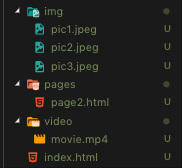
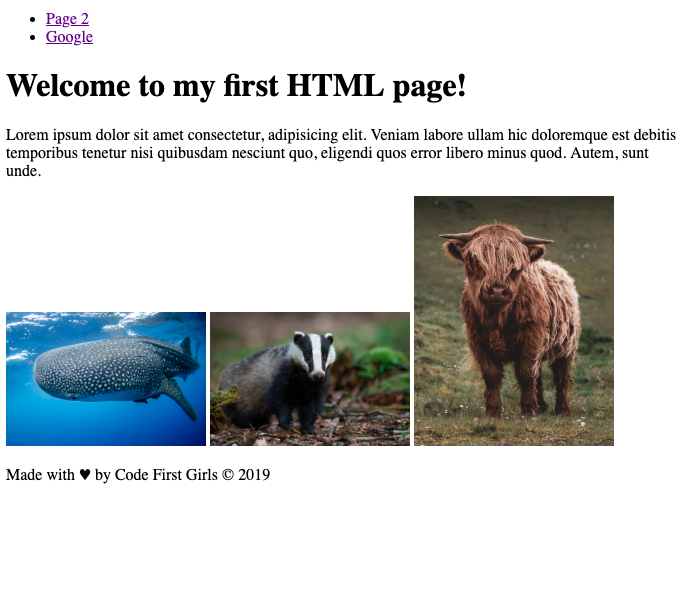
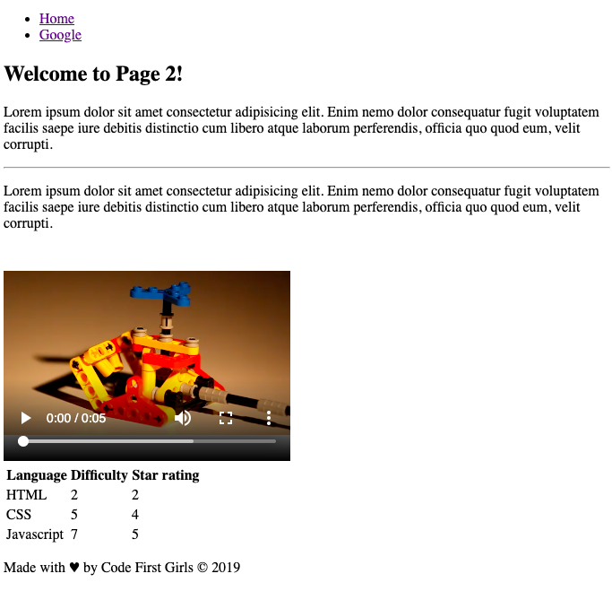

# HTML Homework

## Basic Task:

Create a single HTML site including the following elements. Special attention needs to be paid to the file structure, indenation, structure and comments

#### Page 1

- `<header>...</header>`
- `<nav>...</nav>`
- `<ul>...</ul>` and / or `<ol>...</ol>`
- `<a>`
- `<main>...</main>`
- `<h1>...</h1>` to `<h6>...</h6>`
- `<footer>...</footer>`
- `
...
`
- ``
- `
...
`

## Extended Task:

Create the second page so it contains the following elements, and link the two pages together

- `<video>...</video>` or `<iframe>`
- `<table>...</table>`

## Project organisation

A tidy project is essential for coding, and everything should be in its place. Feel free to add a new folder so long as the files within are relevant

## The theme is up to you, but it could look something like:

`index.html`

`./pages/page2.html`

## Tips and resources

- keep an well-organised project - it will help you heaps!
- [Video Download](http://techslides.com/sample-webm-ogg-and-mp4-video-files-for-html5)
- [Traversy media HTML](https://www.youtube.com/watch?v=UB1O30fR-EE&t=3s)
- [w3schools](https://www.w3schools.com/html/default.asp)

And most importantly, have fun!
