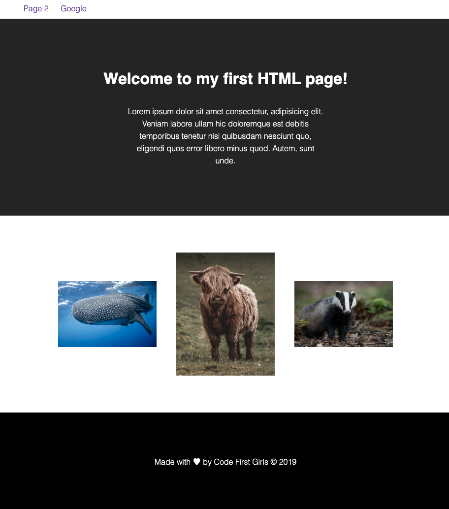
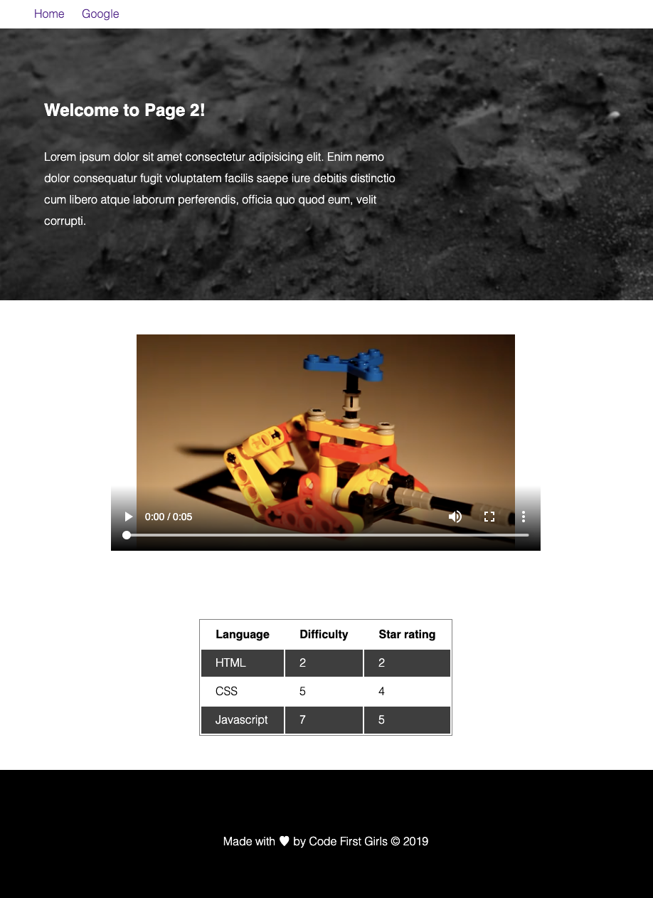

# CSS Homework

## Learning Task:

Style the first page of the HTML homework solution code from last week so it looks like the first image

**index.html**

## Extended Task:

Style the second page of the HTML homework solution code from last week so it looks like the second image

**./pages/page2.html**

## NOTES

- When styling multiple pages from one stylesheet, pay special attention to the copmmon elements / classes
- Folder structure, indentation and comments are critical. Everything should be in its right place
- Don't use CSS Frameworks like Bootstrap - we'll be getting to that later

## Resources

- [Traversy Media CSS 60mins](https://www.youtube.com/watch?v=yfoY53QXEnI&t=6s)
- [Traversy Media Flexbox - 20mins](https://www.youtube.com/watch?v=JJSoEo8JSnc&t=512s)
- [W3Schools](https://www.w3schools.com/css/default.asp)
