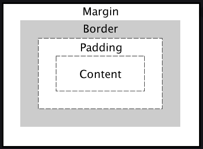

# Intro to Cascading Style Sheets (CSS)

## Overview of Lesson

- HTML recap and homework review
- Learning outcomes
- Intro to CSS
- Anatomy of a CSS declaration
- How to apply CSS
- Code along
- Exercise
- Recap & Closing
- Summary
- Homework

## HTML Recap

- Ask 1-2 students to present their homework, talking through what went well / not well
- Send out the HTML homework solution code

## Learning outcomes

By the end of this lesson learners will:

- be able to define CSS and link their CSS to their HTML.
- Be able to use basic CSS to style their page and position elements on the page.
- be introduced to the box-model through practice.

---

### Intro to CSS

CSS (Cascading Style Sheets) is used to style and layout web pages — for example, to alter the font, colour, size and spacing of your content, split it into multiple columns, or add animations and other decorative features

### Anatomy of CSS (see slide)

- selector (element, class or ID)
- body `{...}`
- property
- value

```css
h1 {
  font-size: 30px;
  color: blue;
}
```

### How to Apply CSS

CSS is written and imported in one of 3 ways:

1. Inline (not recommended)

```html
<h1 style="font-size: 30px; color: blue;">Hello world</h1>
```

2. Internal (not recommended)

```html
<!DOCTYPE html>
<html lang="en">
  <head>
    <style>
      h1 {
        font-size: 30px;
        color: blue;
      }
    </style>
  </head>
  <body>
    <h1>Hello world</h1>
  </body>
</html>
```

3. External (recommended)

```html
<!-- index.html -->
<!DOCTYPE html>
<html lang="en">
  <head>
    <link rel="stylesheet" href="./css/main.css" />
  </head>
  <body>
    <h1>Hello world</h1>
  </body>
</html>
```

```css
/* ./css/main.css */
h1 {
  font-size: 30px;
  color: blue;
}
```

This is the preferred way because it allows for greater separation of code, a crucial part of programming in general

---

## Selectivity (see slide for image)

- Inline Styles are MOST specific
- Element Styles are LEAST specific
- Bad practice to use inline styles and IDs

---

## What can it do?

The short answer is: a LOT!

The web is a whole different beast than what it was when CSS was first invented. Today, entire careers are centered around what you can do with CSS (front-end developers, graphic design and UX/UI).

CSS loosely falls into several categories:

- Typography, Colors and Fonts
- Positioning, Spacing and Display
- Animation and User Interaction (hover / click etc)
- Responsiveness

> The scope of this lesson will only be able to cover the first 2

---

## Code along

#### Wildcard

> incredibly useful technique for getting an idea of how elements fit on the page
>
> You'll see how useful this is as we code through the lesson

```css
* {
  /* overlays every item on the page with an outline. VERY useful for development */
  outline: 1px solid orange;
}
```

#### Box-model

> the cornerstone of CSS - don't need to go into too much detail, just show the diagram that every element is made up of **content**, **padding**, **border** and **margin**



```css
body {
  /* Its common to remove default styles */
  margin: 0;
  padding: 0;
}
```

> explain that here we're targeting the ELEMENTS


#### Mini-recap - importing CSS and Box Model

- Pause here for recap / questions and to allow assistant instructors time to help students who have encountered issues


### Typography

#### Color and Decoration

> let's start with a simple `<h1>`

```html
<h1>Intro to CSS</h1>
```

```css
h1 {
  color: blue;
  text-decoration: underline;
}
```

#### Size

```css
h1 {
  /* ... */
  font-size: 20px;
}
```

#### Font family and weight

> TIP: **ctrl + space** at `font-family: |` will show a list of the default font families

```css
h1 {
  /* ... */
  font-family: Arial, Helvetica, sans-serif;
  font-weight: bold;
}
```


#### Mini-recap - Typography

- Pause here for recap / questions and to allow assistant instructors time to help students who have encountered issues
- Optional challenge: have students practice on their own - back to slides (Slide 12)


#### Classes and IDs

- Classes are a way to target many different elements as you want. They don't have to be the same type of element
- Specified with a `.`

```html
<span class="color1">Cascading </span>
```

```css
.color1 {
  color: aqua;
}
```

- IDs are unique (only 1 allowed)
- Specified with a `#`
- VERY bad practice to use IDs to add styles

```html
<span class="color2" id="specificColor">Style </span>
```

```css
#specificColor {
  color: brown;
}

.color2 {
  color: #ac2399;
}
```

---

## Code along


#### Spacing & Display

Display

> 1. Talk about the default `display:block` vs `display:inline`
> 2. `display: flex` is perhaps one of the most useful advances in CSS. There's far more to it than what we can cover here. In case you're wondering why we're introducing it this early, it's to a) avoid them using floats and b) help them make pages look nicer sooner

```html
<div class="hero">
  <p class="text">
    Lorem ipsum dolor sit amet consectetur adipisicing elit. Quam, soluta quas
    consequatur facere numquam voluptatum labore, eum ratione dolor placeat
    assumenda fugit iusto accusamus atque, porro eveniet tenetur perferendis
    quis!
  </p>
</div>
```

```css
/* we specify a class by prefixing the class name with a .  */
.hero {
  width: 100%;
  height: 200px;
  /* Use the below 3 for perfect centering  */
  display: flex;
  align-items: center;
  justify-content: center;
}

.text {
  width: 300px;
  text-align: justify;
}
```

Spacing

> Expanding the Box Model using a div
>
> Show the students the integrated box model in the chrome dev tools

```html
<div class="box">Box</div>
```

```css
.box {
  /* content */
  width: 150px;
  height: 80px;
  /* padding - top-right-bottom-left */
  padding: 20px 40px 20px 40px; // or 20px 40px;
  /* border - width-style-color */
  border: 5px solid black;
  /* margin */
  margin: 40px;
}
```

#### Mini-recap - Display & Spacing

- Pause here for recap / questions and to allow assistant instructors time to help students who have encountered issues
- Back to slides

---

## Cascading

CSS works by inheritanbce: elements inherit their styles from other elements further down the tree and apply the most recent. The trick is knowing when and how to be specific

Looking at the `<table>` example, we're going to target different elements using a mix of selectors and inheritance

> Talk through briefly about what they're looking at

```html
<table>
  <thead>
    <tr>
      <th>Col 1</th>
      <th><a href="#">Col 2</a></th>
      <th>Col 3</th>
    </tr>
  </thead>
  <tbody>
    <tr class="row">
      <td>Col 1</td>
      <td><a href="#">Col 2</a></td>
      <td>Col 3</td>
    </tr>
    <tr class="row">
      <td>Col 1</td>
      <td><a href="#">Col 2</a></td>
      <td>Col 3</td>
    </tr>
    <tr>
      <td>Col 1</td>
      <td><a href="#">Col 3</a></td>
      <td>Col 3</td>
    </tr>
  </tbody>
</table>
```

> Add some padding and color to every cell, explaining applying CSS to to multiple elements

```css
th,
td {
  padding: 15px;
  color: red;
}
```

> change the color of all links in the table

```css
table a {
  color: purple;
}
```

> but only change the font size of the links in the `<thead>`

```css
thead a {
  font-size: 30px;
}
```

> change the background of all elements in the table with a `.row`

```css
.row {
  background: pink;
}
```

> change the letter spacing of the links withing these classes

```css
.row a {
  letter-spacing: 3px;
}
```

#### Mini-recap - Cascading

- Pause here for recap / questions and to allow assistant instructors time to help students who have encountered issues

---

## Bad practices

**ID**

> Stress that it's regarded as VERY bad practice to use either IDs or !important to target elements as they're almost impossible to overwrite

```css
#h-rule {
  margin: 20px 0;
}
```

**!important**

```css
.row a {
  font-family: sans-serif !important;
}
```

## Exercise

Style the starter code according to the instructions in the HTML

## Recap

You should now know

- How to bring CSS into HTML
- The basic CSS sytax and how to target elements
- What the box-model is
- Some basic styling features
- A bit about display and positioning
- The 'Cascading' part of CSS

## Resources

- [Traversy Media CSS - 60mins](https://www.youtube.com/watch?v=yfoY53QXEnI&t=6s)
- [Traversy Media Flexboox - 20mins](https://www.youtube.com/watch?v=JJSoEo8JSnc&t=512s)
- [W3Schools](https://www.w3schools.com/css/default.asp)
- [Mozilla Documentation](https://developer.mozilla.org/en-US/docs/Learn/CSS/Introduction_to_CSS)

